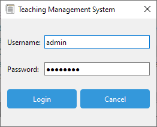
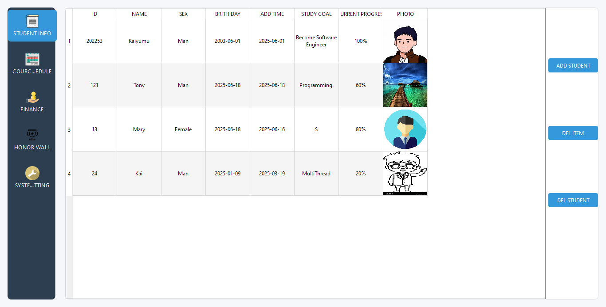
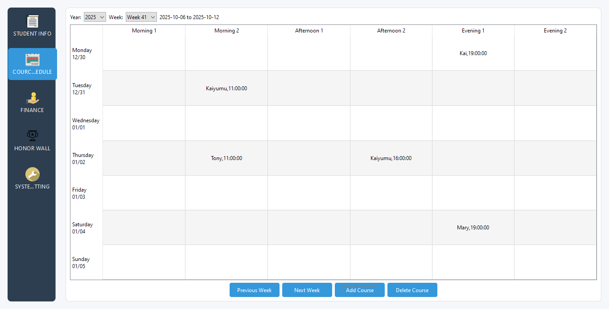
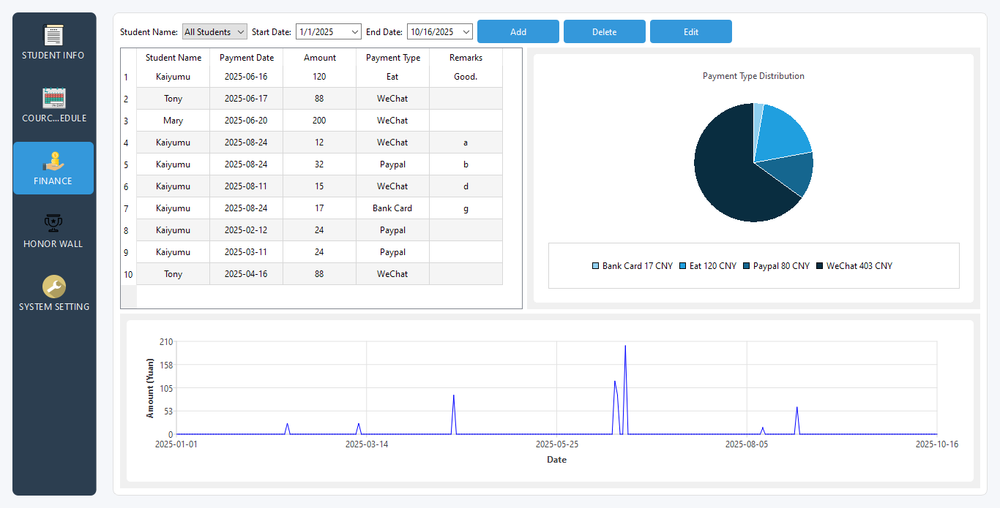
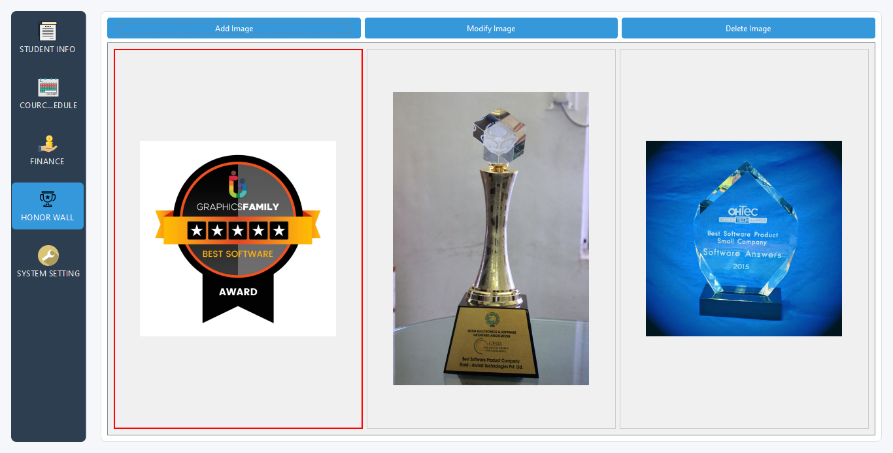

# 学生管理系统

<p align="center">
<strong>语言：</strong>&nbsp; <a href="README.md">English</a> | <strong>中文</strong>
</p>

## 1. 项目概述

学生管理系统是基于 Qt 框架开发的桌面应用程序，旨在为教育机构提供方便的学生信息管理、财务记录、课程安排和荣誉展示功能。系统使用 SQLite 作为数据存储，界面友好，模块结构清晰。

## 2. 功能特性

### 1. 学生信息管理

- 添加、查询及管理学生基本信息
- 支持编辑和更新学生档案
- 结构化存储与展示学生数据

### 2. 财务管理

- 添加与管理学生相关费用记录
- 支持查询与删除财务数据
- 对财务信息进行可视化展示

### 3. 课程安排

- 查看与管理日/周课程安排
- 支持切换上一周/下一周
- 系统化记录与展示课程信息

### 4. 荣誉墙展示

- 展示学生荣誉信息
- 设计荣誉墙界面以便直观查看

## 3. 技术架构

### 开发环境

- 框架：Qt 6.x
- 编译器：MinGW（或系统对应的 C++ 编译器）
- 数据库：SQLite

### 项目结构（概要）

```
StudentManagementSystem/
├── icon/
├── sqllite/
├── style/
├── CMakeLists.txt
├── README.md
├── README_zh.md
├── databasemanager.cpp/.h
├── financialwidget.cpp/.h/.ui
├── honorwallwidget.cpp/.h/.ui
├── main.cpp
├── mainwindow.cpp/.h/.ui
└── studentinfowidget.cpp/.h/.ui
```

## 4. 模块说明

- 数据库管理模块：负责数据库初始化与学生信息的增删改查（`databasemanager.cpp/.h`）
- 财务管理模块：实现财务记录的添加、查询、删除（`financialwidget.*`）
- 荣誉墙模块：展示学生荣誉（`honorwallwidget.*`）
- 课程模块：管理周/日程切换与显示（`schedulewidget.*`）
- 学生信息模块：管理学生基本资料（`studentinfowidget.*`）

## 5. 编译与运行

### 环境要求

- Qt 6.x 或更高
- CMake 3.10+
- 合适的 C++ 编译器（如 MinGW-w64、g++）

### 编译步骤（示例）

```bash
git clone https://github.com/savvyinsight/StudentManagementSystem.git
cd StudentManagementSystem
mkdir build && cd build
cmake ..
make
```

编译完成后，运行 `build` 目录下生成的可执行文件。

## 6. 界面预览

1. 登录



2. 学生信息



3. 课程表



4. 财务



5. 荣誉墙



## 7. 联系方式

如有问题或建议，请通过仓库 Issue 提交或直接联系开发者。

---

感谢使用与关注本项目！
